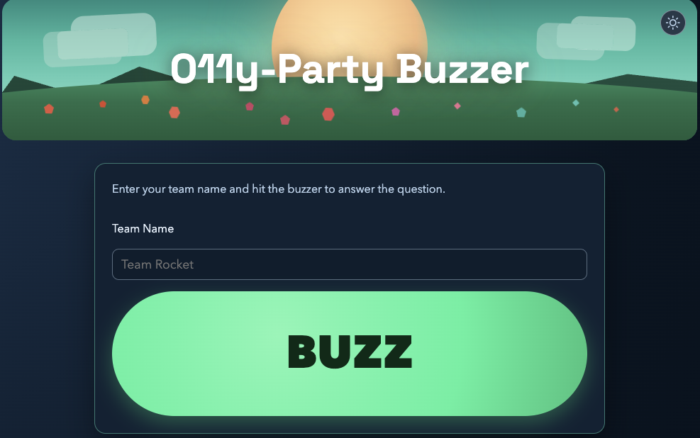

# O11yParty Buzzer (.NET 10 Blazor)



This app is a stateless buzzer UI.

Users enter a team name and press the BUZZ button. The app immediately sends a custom New Relic event and does not persist any state.

## Configure New Relic

Set these values before running:

- `NewRelic__IngestApiKey`
- `NewRelic__AccountId`
- `NewRelic__Region` (`US` or `EU`, optional, defaults to `US`)
- `NewRelic__EventType` (optional, defaults to `TeamBuzzed`)
- `NewRelic__LeadCaptureEventType` (optional, defaults to `LeadCaptureSubmitted`)
- `NewRelic__EventPublishTimeoutSeconds` (optional, defaults to `15`)
- `NewRelic__CircuitBreakerFailureThreshold` (optional, defaults to `3`)
- `NewRelic__CircuitBreakerBreakDurationSeconds` (optional, defaults to `60`)

You can set them as environment variables, user-secrets, or directly in `appsettings.json`.

The app also applies a 30-second request timeout policy for non-`/_blazor` endpoints and logs Blazor circuit lifecycle events for connection diagnostics.

## Run

```bash
dotnet run
```

Then browse to the URL shown in the console.

## Synthetic Failure Injection

Append `?chaos=<mode>` to the URL to simulate failure conditions:

| Mode        | Behavior                                                      |
|-------------|---------------------------------------------------------------|
| `latency`   | Adds an artificial delay before the buzz (default 3000 ms; override with `&latencyMs=<ms>`) |
| `exception` | Throws an unhandled exception on every buzz                   |
| `random`    | Fails ~50% of buzzes at random                                |
| `timeout`   | Simulates a long-running request that times out after 35 s    |

Example: `http://localhost:5071/?chaos=random`

## Event Payload

A single event object is sent with fields:

- `eventType`
- `teamName`
- `buzzedAtUtc`
